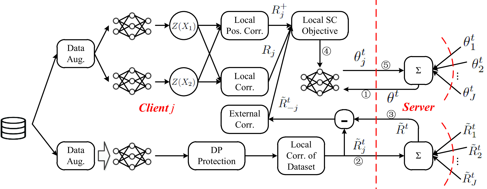

# FedSC_ICML2024
Provable Federated Self-supervised Learning with Spectral Contrastive Objective over Non-i.i.d. Data

Recent efforts have been made to integrate self-supervised learning (SSL) with the framework of federated learning (FL). One unique challenge of federated self-supervised learning (FedSSL) is that the global objective of FedSSL usually does not equal the weighted sum of local SSL objectives. Consequently, conventional approaches, such as federated averaging (FedAvg), fail to precisely minimize the FedSSL global objective, often resulting in suboptimal performance, especially when data is non-i.i.d.. To fill this gap, we propose a provable FedSSL algorithm, named FedSC, based on the spectral contrastive objective. In FedSC, clients share correlation matrices of data representations in addition to model weights periodically, which enables inter-client contrast of data samples in addition to intra-client contrast and contraction, resulting in improved quality of data representations. Differential privacy (DP) protection is deployed to control the additional privacy leakage on local datasets when correlation matrices are shared. We also provide theoretical analysis on the convergence and extra privacy leakage. The experimental results validate the effectiveness of our proposed algorithm.

paper link: https://proceedings.mlr.press/v235/jing24b.html

## A Comparison with SOTAs

FedSC (proposed) is the only one applying DP mechanism on components other than the encoder. Moreover, FedSC is the only provable method among them.

|          | Info. shared besides encoder | Privacy Protection | Provable |
|----------|------------------------------|--------------------|----------|
| **FedU** | predictor                    | ✗                  | ✗        |
| **FedEMA** | predictor                    | ✗                  | ✗        |
| **FedX** | N/A                          | ✗                  | ✗        |
| **FedCA** | representations              | ✗                  | ✗        |
| **FedSC** | correlation matrices          | ✓                  | ✓        |

## Diagram of the Proposed FedSC

1. The server synchronizes local models with the global model.
2. Clients compute their local correlation matrices of the dataset and send them to the server.
3. The server distributes the aggregated global correlation matrices back to the clients.
4. The clients proceed to update their local models in accordance with the local objective specified in Eq. (Equation reference).
5. The server aggregates the local models and initiates the next iteration.

